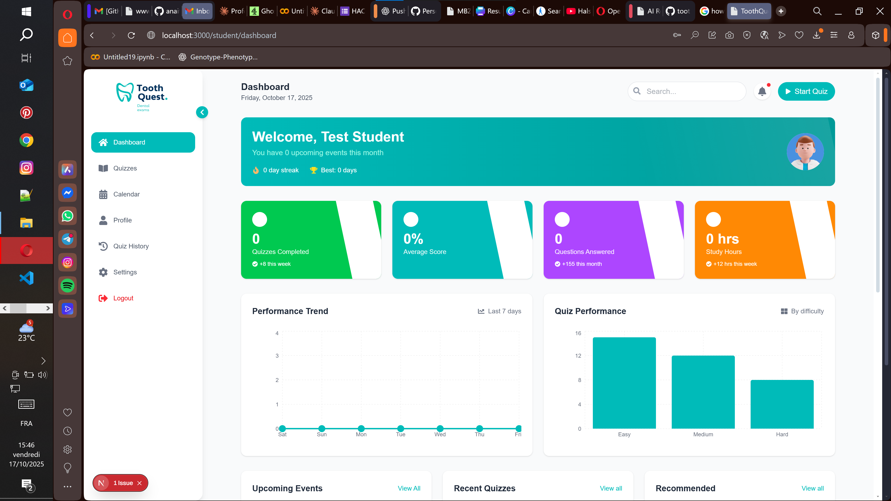
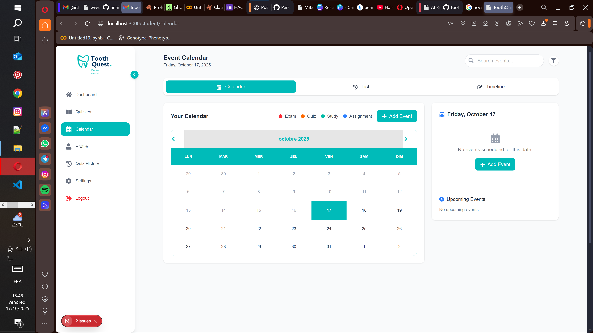

# 🦷 ToothQuest

**ToothQuest** is an AI-powered learning platform designed for **dental students** to enhance their understanding through **adaptive quizzes** that evolve based on user performance, progress, and knowledge gaps.  

It combines **Artificial Intelligence**, **Natural Language Processing (NLP)**, and **Gamification** to deliver a personalized and engaging study experience.

```markdown


---

## 🚀 Features

- 🤖 **AI-Generated Quizzes** – Automatically creates dental quizzes tailored to each student’s level.  
- 📊 **Adaptive Learning** – Adjusts question difficulty based on past answers and progress.  
- 🧠 **Error-Based Reinforcement** – Repeats or reformulates questions from topics where the student struggles.  
- 🧩 **Topic Variety** – Covers key dental disciplines such as anatomy, radiology, pathology, prosthodontics, and more.  
- 🕹️ **Gamified Experience** – Includes badges, levels, streaks, and progress tracking.  
- 📈 **Performance Analytics** – Visualizes learning progress and highlights strengths & weaknesses.  
- 🧑‍⚕️ **Instructor Mode (optional)** – Allows teachers to view class statistics and recommend topics.

---

## 🧬 How It Works

1. **Initial Assessment:**  
   The platform starts with a diagnostic quiz to determine your current level.  

2. **Personalized Quiz Generation:**  
   The AI dynamically generates new questions using large language models (LLMs) fine-tuned on dental knowledge.  

3. **Adaptive Feedback:**  
   When you make a mistake, the system explains the correct answer and gives follow-up questions to reinforce learning.  

4. **Progress Tracking:**  
   Your results are stored and analyzed to guide your learning path automatically.

---

## 🏗️ Tech Stack

- **Frontend:** React / Next.js (TailwindCSS for styling)  
- **Backend:** Django REST Framework / Flask  
- **Database:** PostgreSQL  
- **AI Models:** GPT-based LLMs, BERT for topic understanding  
- **Visualization:** Recharts / Chart.js  

---


